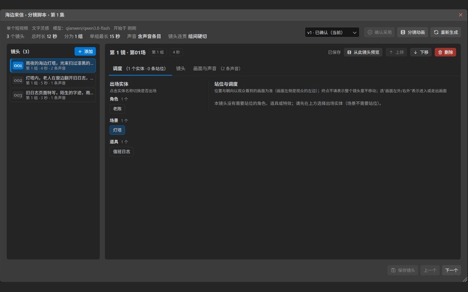
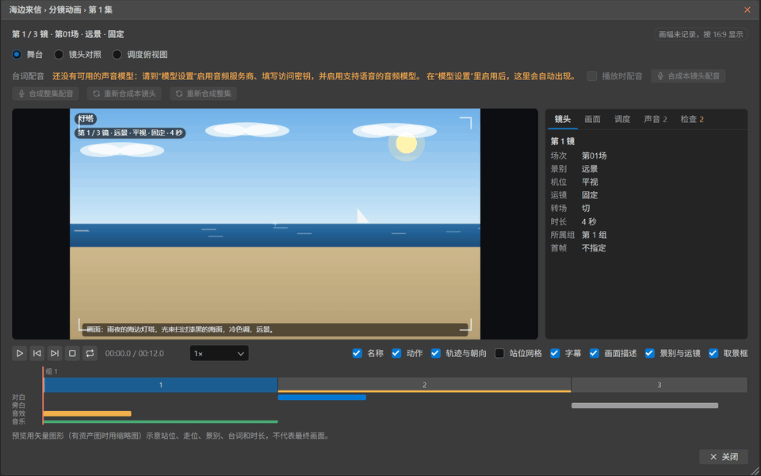
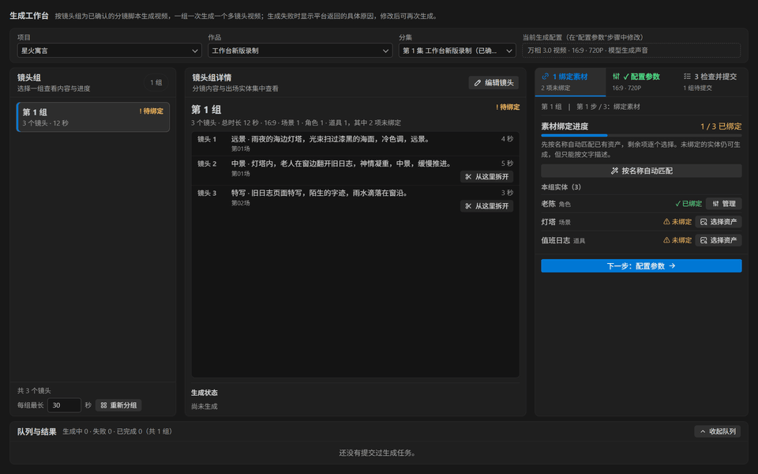

<div align="center">

# 如见 RUJIAN

</br>

## 让剧本，如在眼前。


> ### QQ 交流群：173271117

</br>
</div>

<div align="center">

## 文学创作

创意构思、小说改编、原创文稿，或从图片开始。


## 剧本与分镜

把故事整理成剧本和镜头；逐步检查、编辑、确认。


### 查看分镜

逐镜检查镜头描述、场景实体、时长与声音条目。



### 分镜动态预演（Animatic）

生成视频前先预演整集分镜：查看角色走位、镜头衔接和声音时间线，并切换舞台、镜头对照与调度俯视图。



预览以矢量图形示意，不代表最终画面；默认不调用模型，也不产生费用。

## 资产准备

管理角色、场景、道具与声音，让素材跟随创作流程。新建资产时可直接保存、按设定生成，或先生成提示词再出图；也可从分镜实体带入设定并自动绑定。


### 视频生成

连接你配置的模型，按镜头组生成视频并管理结果。

#### 生成工作台

按镜头组查看生成内容、配置参数、检查并提交任务。



</div>

<div align="center">

## 让剧本成为可见的故事

从文学内容开始，而不止于提示词。

从剧本到分镜，每个阶段都可审阅和修改，确认后再进入下一步。

生成前预览分镜节奏与调度；生成后管理任务、版本与素材。

</div>

<div align="center">

## 开始使用

如见 Studio 是桌面应用，目前提供 Windows 版本。安装后打开应用，从左侧菜单进入各个页面；页面以标签形式在右侧打开，可以同时打开多个，同一页面不会重复打开。

先在左侧菜单“设置”中打开“模型”，配置支持的模型服务商及访问密钥，即可开始创作。模型调用由服务商计费。

访问密钥经系统加密后保存在本机，不会写入数据库。数据可在“数据备份”页备份与恢复。

</div>

<div align="center">

## 从源码运行

需要 Node.js 22.12 或更高版本。

```bash
npm install
npm start          # 开发模式运行
npm test           # 编译检查与全部测试
npm run make       # 制作安装包（Windows 下建议使用 build.ps1）
```

</div>

<div align="center">

## 许可证

本项目采用 [GNU 通用公共许可证第 3 版（GPLv3）](LICENSE)。分发本项目或其修改版时，必须在 GPLv3 下提供对应源码；可以收费分发，但不得闭源分发。

</div>

<div align="center">

[GitHub](https://github.com/sengbin/rujian-studio) · [GNU GPL v3.0 许可证](LICENSE)

图标来自 [Tabler Icons](https://github.com/tabler/tabler-icons)，采用 MIT 许可证。

</div>
